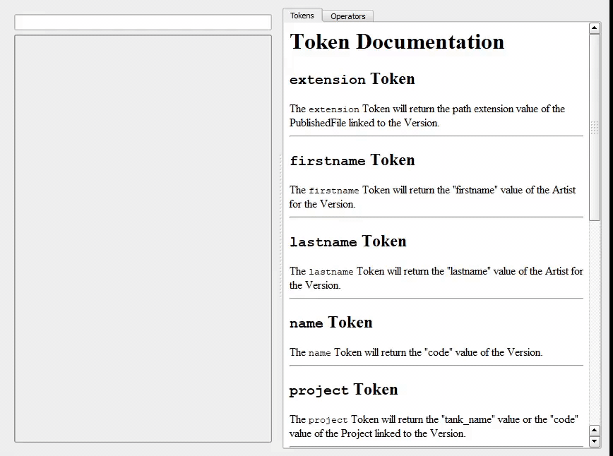

# sept_qt
  

Common Qt components useful for displaying and editing sept Token Expressions

# Usage.py
A basic usage.py is provided to show how you might used these components in your application.

These components can handle errors and pass resolving errors back to the input widget to display.

